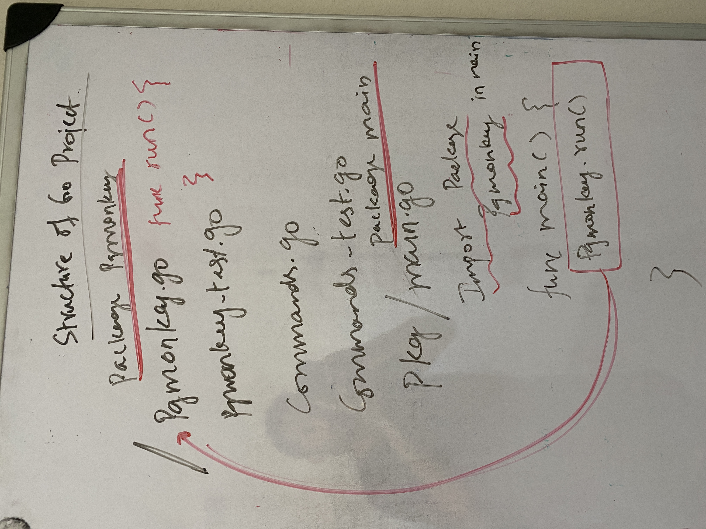

# Go-Project-Structure

Have seen different structure in different projects. One simple structure that I encountered a go project [envelope](https://github.com/tgirier/envelope), which uses a very simple and clean structure.

