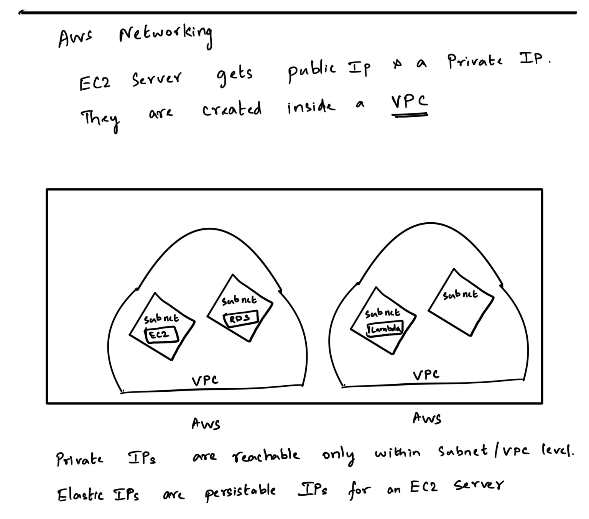

# Aws-Networking-Basics

- Companies create VPC to logically isolate their resources. eg. PCI VPC and a non PCI VPC
- Subnets (as the name suggests) its a subnetwork within a giant network. More on https://www.cloudflare.com/learning/network-layer/what-is-a-subnet/
- Then there is security groups which is pretty much firewall to your resources.

