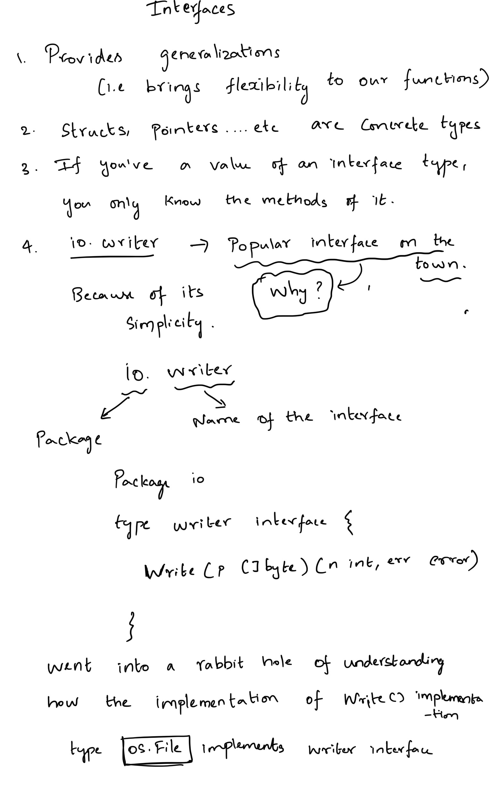

# Go-Internaces



Then I wondered where the actual implementation of Write() happening for a os.File type.

Definition of Write() is inside os/file.go.
Write() calls write()
https://github.com/golang/go/blob/master/src/os/file.go#L172
```
// Write writes len(b) bytes to the File.
// It returns the number of bytes written and an error, if any.
// Write returns a non-nil error when n != len(b).
func (f *File) Write(b []byte) (n int, err error) {
	if err := f.checkValid("write"); err != nil {
		return 0, err
	}
	n, e := f.write(b)
	if n < 0 {
		n = 0
	}
	if n != len(b) {
		err = io.ErrShortWrite
	}

	epipecheck(f, e)

	if e != nil {
		err = f.wrapErr("write", e)
	}

	return n, err
}
```

write() calls fd.Write()
https://github.com/golang/go/blob/master/src/os/file_posix.go#L48:16
// write writes len(b) bytes to the File.
// It returns the number of bytes written and an error, if any.
func (f *File) write(b []byte) (n int, err error) {
	n, err = f.pfd.Write(b)
	runtime.KeepAlive(f)
	return n, err
}

Write() calls ignoringEINTRIO() and passing a syscall.Write
https://github.com/golang/go/blob/master/src/internal/poll/fd_unix.go#L261
```
func (fd *FD) Write(p []byte) (int, error) {
    if err := fd.writeLock(); err != nil {
        return 0, err
    }
    defer fd.writeUnlock()
    if err := fd.pd.prepareWrite(fd.isFile); err != nil {
        return 0, err
    }
    var nn int
    for {
        max := len(p)
        if fd.IsStream && max-nn > maxRW {
            max = nn + maxRW
        }
        n, err := ignoringEINTRIO(syscall.Write, fd.Sysfd, p[nn:max])
        if n > 0 {
            nn += n
        }
        if nn == len(p) {
            return nn, err
        }
        if err == syscall.EAGAIN && fd.pd.pollable() {
            if err = fd.pd.waitWrite(fd.isFile); err == nil {
                continue
            }
        }
        if err != nil {
            return nn, err
        }
        if n == 0 {
            return nn, io.ErrUnexpectedEOF
        }
    }
}
```

Further low level functions are implemented here. At this point, I no longer understand all that :)
https://github.com/golang/go/blob/master/src/runtime/sys_darwin.go
https://github.com/golang/go/blob/master/src/runtime/sys_libc.go#L17:6

