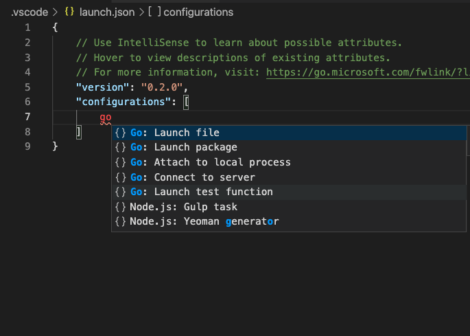

# Go-Debugging-Vscode

I wanted to debug a handler function in a Go webserver. To do that first I needed to install [delve](https://github.com/go-delve/delve). 

I didn't have the latest version of delve, so I need to [update it](https://github.com/go-delve/delve/issues/1974).

Next, I created launch.json inside .vscode directory on the root of the repository. The simple way to populate launch.json was to just type **go** inside "configurations" key and let VSCode auto-populate the config.



The complete config for launch.json is below:

```
{
    // Use IntelliSense to learn about possible attributes.
    // Hover to view descriptions of existing attributes.
    // For more information, visit: https://go.microsoft.com/fwlink/?linkid=830387
    "version": "0.2.0",
    "configurations": [
        {
            "name": "Launch file",
            "type": "go",
            "request": "launch",
            "mode": "debug",
            "program": "${file}",
            "env": {
                "CLIENT_ID":"replaceme",
                "CLIENT_SECRET":"replaceme"
            }
        }
    ]
}
```

To start the debugging, select (or keep the cursor) the main.go file and press F5 or Run -> Start Debugging. Then I called the endpoint that I wanted to debug. Of course, added breakpoints, stepped in etc.

I also learnt that I can get launch `delve` directly on the terminal by invoking `dlv debug` 


```
visi@visis-MacBook-Pro spinup % dlv debug
Type 'help' for list of commands.
(dlv) 
```

References:

1. https://github.com/campoy/go-tooling-workshop/blob/master/3-dynamic-analysis/1-debugging/1-delve.md
2. https://github.com/golang/vscode-go/blob/master/docs/debugging.md
3. https://www.digitalocean.com/community/tutorials/debugging-go-code-with-visual-studio-code
