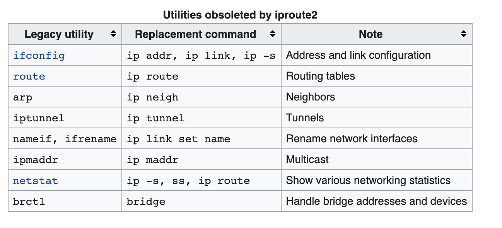

# Iproute2

[From wiki](https://en.wikipedia.org/wiki/Iproute2)

> iproute2 is a collection of userspace utilities for controlling and monitoring various aspects of networking in the Linux kernel, including routing, network interfaces, tunnels, traffic control, and network-related device drivers.

So, that means commands like `ip` `tc` (traffic control) is provided by iproute2 !