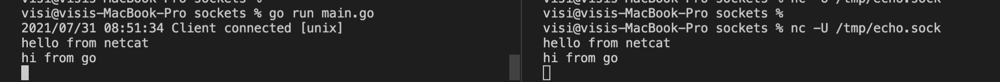

# Unix-Domain-Sockets

I have heard this for ages, but never really took time to understand about it.

Unix Domain Sockets is used for inter process communication.

What is Inter Process Communication?

Two Processes running on the same host.

We can use loopback interface for it. Why sockets?

Performance. Loopback interface avoids certain overheads of TCP but not completely removes it. IPC relies on sockets which are files in Linux (as like everything).

A simple implementation of sockets in Go. Slight variation of Eli's work https://eli.thegreenplace.net/2019/unix-domain-sockets-in-go/

``` go
package main

import (
	"io"
	"log"
	"net"
	"os"
)

const SockAddr = "/tmp/echo.sock"

func echoServer(c net.Conn) {
	log.Printf("Client connected [%s]", c.RemoteAddr().Network())
	io.Copy(os.Stdout, c)
	c.Close()
}

func sendServer(c net.Conn) {
	io.Copy(c, os.Stdin)
	c.Close()
}
func main() {
    if err := os.RemoveAll(SockAddr); err != nil {
		log.Fatal(err)
	}

	l, err := net.Listen("unix", SockAddr)
	if err != nil {
		log.Fatal("listen error:", err)
	}
	defer l.Close()

	for {
		// Accept new connections, dispatching them to echoServer
		// in a goroutine.
		conn, err := l.Accept()
		if err != nil {
			log.Fatal("accept error:", err)
		}

		go echoServer(conn)
		go sendServer(conn)
	}
}
```

This program acts as both client and server. It receives message from client and prints it to stdout. It also accepts message from stdin and sends it to server.

